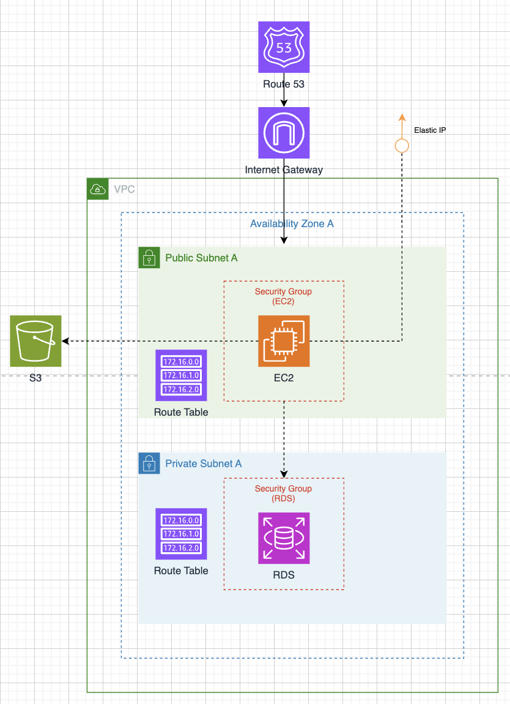

# 想い帳
本アプリは、カップルで日記を共有するWebアプリケーションです。  
学習目的で作成しており、アプリケーション開発とインフラ構築は担当を分けて進めています。

現在は最低限の機能のみを実装していますが、
今後は他のAWSサービスも取り入れ、機能拡張や構成の改善を行っていく予定です。

## 今後追加したい機能
- CloudFormation：インフラ構成をコード化し、自動デプロイを可能にする
- Cognito：ユーザー認証・認可の管理
- SES：ユーザーへのメール通知機能（日記を書いたときに相手に通知が届く）
- AWS Lambda + EventBridge：定期処理実装（毎日 21:00 に「今日の日記書いた？」を送るなど）
  
# インフラ担当 
## 1. 概要 
本リポジトリは、WebアプリケーションをAWS上に構築した際の
インフラ構成をまとめたものです。

- 目的：AWSの基本的な設計・構築スキルの習得
- 想定：小規模Webアプリ
- 重視した点：セキュリティ・可用性・コスト

## 2. 構成図

## 3. AWS構成
- Route 53：ドメイン管理
- EC2：アプリケーション実行
- Elastic IP：固定IP
- RDS：データベース（PostgreSQL）
- VPC：ネットワーク（Public・Private Subnet）
- Security Group：通信制御
- CloudWatch：ログ・監視

## 4. 通信の流れ
1. ユーザーがブラウザからアクセス
2. Route 53でドメイン名を名前解決
3. ユーザーからEC2（Nginx）へHTTPS通信
   - Let’s Encrypt + certbot を使用してSSL証明書を設定
4. Nginxがアプリケーション（EC2上）へリクエストを転送
5. アプリケーションからRDSへデータアクセス

## 5. 工夫した点
- 想定ユーザー数が少ないためALBは導入せず、Let’s Encrypt + certbotでHTTPS対応
- RDSは直接インターネットからアクセス不可
- Route 53 + Elastic IPにより、EC2再起動時も安定したアクセスを維持
